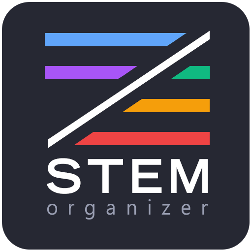
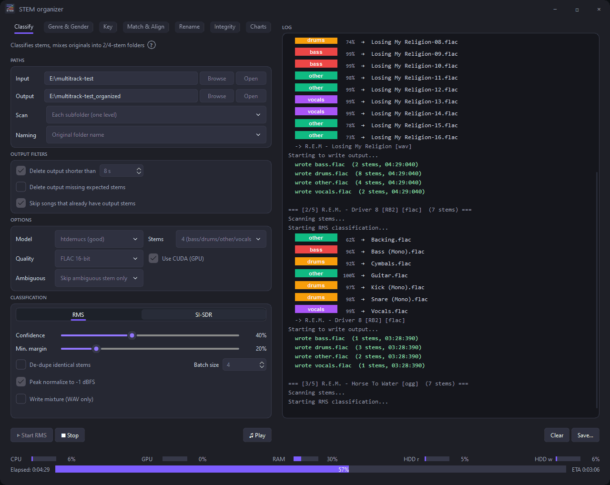

<p align="center">
  
</p>

<div align="center">

# STEM organizer

Organize, classify, prepare and balance audio datasets.<br>
Automatically create 2- or 4-stems, tag genre/style, gender/reverb, vocal type, and key, align tracks, check integrity, and export charts.

**By:** Gilliaan & Bas Curtiz  
**Video:** [How to install & use](https://youtu.be/9xvfCQVhs1Y)

</div>

<p align="center">
  
</p>

PySide6 desktop app for building and auditing stem libraries. Hover **?** in any tab for per-control help.

Default ML path is **torch-free**: ONNX Runtime (`onnxruntime-gpu`, CUDA EP on NVIDIA). Demucs does **not** use DirectML.

## Tabs

| Tab | What it does |
|-----|----------------|
| **Classify** | [Demucs](https://github.com/facebookresearch/demucs) (HTDemucs ONNX) RMS classify → group stems<br>optional [SI-SDR](https://source-separation.github.io/tutorial/basics/evaluation.html#si-sdr) quality filter; export organized folders |
| **Genre & Gender** | **Genre** — [MAEST](https://huggingface.co/mtg-upf/discogs-maest-30s-pw-129e) genre/style tags<br>**Gender** — [EffNet gender](https://essentia.upf.edu/models.html#voice-gender) (male/female) + In-house trained reverb (dry/wet)<br>**Vocal type** — [PANNs](https://github.com/qiuqiangkong/audioset_tagging_cnn) (Singing/Speech/Rapping/Humming/Choir) |
| **Key** | In-house trained KeyNet CNN → `KEY` / Initial key — [outperforms](https://docs.google.com/spreadsheets/d/1asmBVlIjimZ9XAmK5JE42SX4vAvjGqjLflukYBgFSuE/edit?usp=sharing) [original model](https://github.com/a1ex90/MusicalKeyCNN/blob/main/checkpoints/keynet.pt) + [MIK](https://mixedinkey.com/) |
| **Match & Align** | Pair instrumental/vocal folders, organize pairs, align stems to a reference |
| **Rename** | Rule-based sample rename + optional instrument Auto-detect ([OpenMIC](https://research.atspotify.com/publications/openmic-2018-an-open-dataset-for-multiple-instrument-recognition) / [hear21passt](https://github.com/kkoutini/passt_hear21)) |
| **Integrity** | **Compression** — [FLAC Detective](https://pypi.org/project/flac-detective/) lossless/lossy<br>**Corruption** — fast/deep verify + fix ([AudioTester](http://www.vuplayer.com/other.php) / [foobar2k](https://www.foobar2000.org/) alike)<br>**Convert** — batch to FLAC |
| **Charts** | Scan library roots → donuts, genre/style breakdown, [SI-SDR](https://source-separation.github.io/tutorial/basics/evaluation.html#si-sdr) bars<br>Export PNG/PDF + output balanced dataset |

Downstream tabs can auto-fill paths from Classify output (`*_organized`).

## Requirements

- **Windows**
- **Python 3.10 or 3.11** on PATH (for `install-deps.bat` / `build.bat` from source)
- Disk for ONNX weights + tools (`models\`, ffmpeg/mp3val/flac beside the app)
- **NVIDIA GPU** optional (CUDA EP via `onnxruntime-gpu`); CPU works everywhere

## Quick start (from source)

```bat
install-deps.bat
.venv\Scripts\python.exe run_stem_organizer.py
```

`install-deps.bat` at the project root:

1. Creates `.venv` and installs `requirements.txt` (PySide6, `onnxruntime-gpu`, librosa, flac-detective, …)
2. Downloads **ffmpeg**, **mp3val**, and **flac** next to the project

Place ONNX weights under `models\` / tagger folders for local runs, or use the installer (downloads from GitHub Release `models`).

## Build `.exe`

```bat
build.bat
cd dist\STEM-organizer
install-deps.bat
STEM-organizer.exe
```

`build.bat` freezes ML deps from `requirements.txt`. After build, `install-deps.bat` beside the EXE only fetches missing **ffmpeg / mp3val / flac** (ML is already in the freeze).

Installer: compile `stem_organizer.iss` → downloads the 8 ONNX assets from
[bascurtiz/STEM-organizer-models](https://github.com/bascurtiz/STEM-organizer-models) tag `models`.

### Model assets

Shipped ONNX set (installer downloads from the models Release; not in source zip):

| Feature | Path |
|---------|------|
| Demucs HTDemucs | `models\htdemucs.onnx` |
| PANNs Cnn14 | `panns_tagger\models\cnn14.onnx` |
| PaSST OpenMIC | `instrument_tagger\models\passt_openmic.onnx` |
| MAEST genre | `genre_gender_tagger\models\maest_discogs519.onnx` |
| EffNet embeddings | `genre_gender_tagger\models\discogs-effnet-bsdynamic-1.onnx` |
| Gender EffNet | `genre_gender_tagger\models\gender-discogs-effnet-1.onnx` |
| Vocal reverb | `genre_gender_tagger\models\vocal_reverb.onnx` |
| KeyNet | `key_tagger\checkpoints\nf50-q05-221125.onnx` |

Tiny sidecars in the repo (no weights): `maest_discogs519.id2label.json`,
`vocal_reverb.config.json`, `panns_tagger\models\class_labels_indices.csv`.

## Metadata tags (Charts sources)

Charts reads these tags from your library:

| Chart | Tag |
|-------|-----|
| SI-SDR | `SDR` |
| Genre / Style | `GENRE`, `STYLE` |
| Gender / Reverb | `GENDER`, `REVERB` |
| Vocal type | `VOCAL_TYPE` |
| Keys | Initial key (`TKEY` / `INITIALKEY`; legacy `KEY` fallback) |
| Compression | `COMPRESSION` |

## Project layout

```
STEM-organizer-Py6/
├── run_stem_organizer.py      # Entry point
├── install-deps.bat           # Source: .venv + tools; frozen: tools only
├── build.bat                  # PyInstaller → dist\STEM-organizer\
├── requirements.txt           # Pinned ORT/CUDA + audio stack
├── stem_organizer.iss         # Inno Setup (external model download)
├── stem_organizer/            # PySide6 UI + dataset tools
├── genre_gender_tagger/       # MAEST + EffNet tagger
├── instrument_tagger/         # PaSST Auto-detect
├── panns_tagger/              # PANNs vocal type
└── key_tagger/                # KeyNet key detection
```

## License

[MIT](LICENSE)
